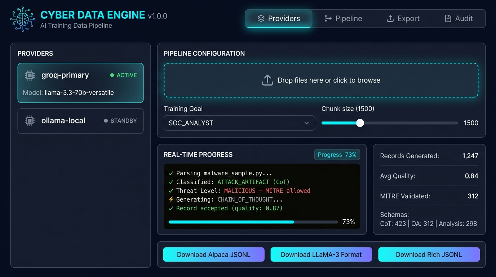
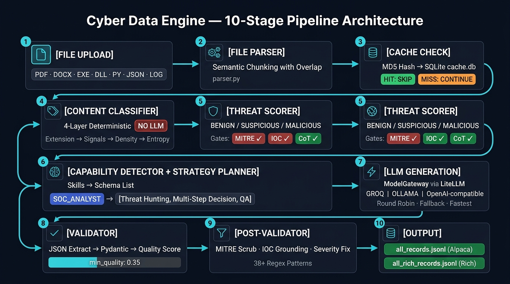

<div align="center">



# Cyber Data Engine v1.0.0

**A deterministic, multi-schema pipeline for generating hallucination-free cybersecurity training datasets for LLM fine-tuning.**

[](LICENSE)
[](https://www.python.org/)
[](https://fastapi.tiangolo.com/)
[](https://docs.pydantic.dev/)
[](https://docs.litellm.ai/)

</div>

---

## 🏗️ Architecture

<div align="center">

</div>

---

## 📋 Table of Contents

1. [What is Cyber Data Engine?](#what-is-cyber-data-engine)
2. [Key Features](#key-features)
3. [Hardware Requirements](#hardware-requirements)
4. [Installation](#installation)
5. [Quick Start](#quick-start)
6. [Provider Setup](#provider-setup)
7. [Training Goals](#training-goals)
8. [Supported Input Types](#supported-input-types)
9. [Output Schemas & Formats](#output-schemas--formats)
10. [Output Field Reference](#output-field-reference)
11. [API Reference](#api-reference)
12. [Project Structure](#project-structure)
13. [Configuration Reference](#configuration-reference)
14. [Running Tests](#running-tests)
15. [Known Limitations](#known-limitations)
16. [Contributing](#contributing)
17. [Security](#security)
18. [License](#license)

---

## What is Cyber Data Engine?

Cyber Data Engine (CDE) converts raw cybersecurity files into structured, high-quality **instruction-tuning datasets** for fine-tuning Large Language Models on cybersecurity tasks.

**The problem it solves:** Creating cybersecurity training data is expensive, slow, and prone to LLM hallucination — fabricated MITRE IDs, invented IOCs, and unsupported threat claims destroy dataset quality. CDE solves this by:

1. **Classifying content deterministically** — no LLM is used for classification; only rule-based algorithms.
2. **Routing to the correct schema** — each chunk generates the most appropriate training format based on content type and training goal.
3. **Validating against the source** — generated MITRE IDs, IOCs, and threat claims are cross-checked against the original text. Hallucinations are scrubbed automatically.
4. **Scoring output quality** — every generated record receives a quality score; records below the threshold are rejected.

---

## Key Features

| Feature | Description |
|---------|-------------|
| 🛡️ **Zero-Hallucination Guard** | Deterministic MITRE Triple-Gate + 38+ regex evidence patterns |
| 🧠 **13 Output Schemas** | CoT, Threat Hunting, Forensic Timeline, Detection Engineering, and more |
| 🎯 **11 Training Goals** | SOC Analyst, Malware Analyst, Red Team, CTI Analyst, etc. |
| 🔌 **Multi-Provider Support** | Ollama, Groq, OpenAI-compatible APIs via LiteLLM |
| ⚡ **Real-Time SSE Progress** | Live pipeline monitoring in the browser |
| 📊 **Quality Scoring** | Grounding, diversity, and structural completeness scoring |
| 🔒 **Thread-Safe Cache** | SQLite + threading.Lock deduplication |
| 🌊 **Memory-Safe Streaming** | Line-by-line file reads — no OOM on large datasets |

---

## Hardware Requirements

| Mode | CPU | RAM | GPU |
|------|-----|-----|-----|
| **Cloud API** (Groq, OpenAI-compatible) | Any, 2+ cores | 4 GB | Not required |
| **Local LLM** (Ollama, 7B model) | 4+ cores | 16 GB | 8 GB VRAM (RTX 3070+) |
| **Local LLM** (Ollama, 13B model) | 8+ cores | 32 GB | 16 GB VRAM (RTX 3090+) |
| **Local LLM** (Ollama, 70B model) | 16+ cores | 64 GB | 40+ GB VRAM (A100/H100) |

> **Recommended for beginners:** Use Groq API (free tier) with `llama-3.3-70b-versatile`. No GPU required.

---

## Installation

### Prerequisites

- Python 3.10 or higher
- `pip` package manager
- (Optional) [Ollama](https://ollama.com/) for local LLM inference

### Steps

```bash
# 1. Clone the repository
git clone https://github.com/your-org/cyber-data-engine.git
cd cyber-data-engine

# 2. Create and activate a virtual environment
python -m venv .venv
.venv\Scripts\activate        # Windows
source .venv/bin/activate      # Linux / macOS

# 3. Install dependencies
pip install -r requirements.txt
pip install -e .               # install shared_lib as editable package

# 4. Set up provider config
cp config/providers.json.example config/providers.json
# Edit config/providers.json — use ${ENV_VAR} placeholders for API keys
```

---

## Quick Start

```bash
# Start the server
uvicorn backend.main:app --host 127.0.0.1 --port 59919

# Windows: use the provided script
start_web.bat
```

Open **http://localhost:59919** in your browser.

**3 steps to your first dataset:**

```
1. Providers tab  →  Add your LLM provider (Groq / Ollama)
2. Pipeline tab   →  Upload files + select Training Goal + Run
3. Export tab     →  Download all_records.jsonl when complete
```

---

## Provider Setup

**Never hardcode API keys.** Use environment variables:

```bash
# Windows PowerShell
$env:GROQ_API_KEY = "gsk_your_key_here"

# Linux / macOS
export GROQ_API_KEY="gsk_your_key_here"
```

`config/providers.json` (use `${VAR}` syntax):

```json
[
  {
    "name": "groq-primary",
    "provider_type": "openai_compatible",
    "endpoint": "https://api.groq.com/openai/v1",
    "model": "llama-3.3-70b-versatile",
    "api_key": "${GROQ_API_KEY}",
    "temperature": 0.15,
    "max_tokens": 8000,
    "timeout": 60,
    "max_retries": 3,
    "enabled": true,
    "preferred_schemas": []
  }
]
```

### Supported Providers

| Provider | `provider_type` | Endpoint |
|----------|-----------------|----------|
| Groq | `openai_compatible` | `https://api.groq.com/openai/v1` |
| OpenAI | `openai_compatible` | `https://api.openai.com/v1` |
| Ollama (local) | `ollama` | `http://localhost:11434/api/generate` |
| LM Studio | `openai_compatible` | `http://localhost:1234/v1` |
| vLLM | `openai_compatible` | `http://localhost:8000/v1` |

---

## Training Goals

| Training Goal | Target Role | Primary Schemas |
|---------------|-------------|-----------------|
| `GENERAL_CYBER` | Generic | CoT, QA, Analysis |
| `SOC_ANALYST` | SOC/SIEM analyst | Threat Hunting, Multi-Step Decision, QA |
| `MALWARE_ANALYST` | Malware RE | CoT, Analysis, Negative Example |
| `THREAT_HUNTER` | Threat hunter | Threat Hunting, Detection Engineering, CoT |
| `PENETRATION_TESTER` | Pen tester | Code Gen, Code Review, Tool Usage |
| `INCIDENT_RESPONDER` | IR team | Incident Playbook, Forensic Timeline, CoT |
| `FORENSIC_INVESTIGATOR` | Digital forensics | Forensic Timeline, Analysis, CoT |
| `DETECTION_ENGINEER` | SIEM rule writer | Detection Engineering, Threat Hunting |
| `CTI_ANALYST` | Threat intelligence | Analysis, CoT, QA |
| `VULN_RESEARCHER` | Vulnerability researcher | Code Review, Code Gen, CoT |
| `RED_TEAM` | Red team operator | Tool Usage, Code Gen, Negative Example |

---

## Supported Input Types

| Category | Extensions | Notes |
|----------|------------|-------|
| **Documents** | `.pdf`, `.docx`, `.doc` | Full text extraction |
| **Spreadsheets** | `.xlsx`, `.xls`, `.csv`, `.tsv` | Row-based chunking |
| **Binaries** | `.exe`, `.dll`, `.elf`, `.bin` | Header + ASCII string extraction |
| **Archives** | `.zip` | File manifest extraction |
| **Threat Intel JSON** | `.json` | STIX2, SIGMA, Suricata, OpenIOC auto-detected |
| **Source Code** | `.py`, `.js`, `.c`, `.cpp`, `.ps1`, etc. | UTF-8 heuristic detection |
| **Text / Logs** | `.txt`, `.log`, `.md` | Semantic chunking with overlap |

---

## Output Schemas & Formats

CDE generates training data in **13 schemas**:

| Schema | Use Case |
|--------|----------|
| `chain_of_thought` | Deep reasoning for complex analysis tasks |
| `analysis` | Structured threat intelligence reports |
| `qa` | Question-answer pairs for RAG/evaluation |
| `chat` | Multi-turn SOC investigation simulations |
| `code_gen` | Security tool generation |
| `code_review` | Vulnerability detection and secure coding |
| `incident_playbook` | Step-by-step IR response guides |
| `tool_usage` | CLI tool reasoning and command generation |
| `threat_hunting` | Proactive hunt hypotheses and queries |
| `multi_step_decision` | Complex analyst decision chains |
| `detection_engineering` | SIEM/EDR detection rule creation |
| `forensic_timeline` | Digital artifact analysis and timelines |
| `negative_example` | Teaching common analyst mistakes |

### Output Files

| File | Format |
|------|--------|
| `output/all_records.jsonl` | Alpaca `{instruction, input, output}` — compatible with all major fine-tuning frameworks |
| `output/all_rich_records.jsonl` | Full metadata: quality score, MITRE IDs, IOCs, provider, severity |
| `GET /api/v1/export/llama3` | LLaMA-3 ChatML format with special tokens |

---

## Output Field Reference

**`output/all_records.jsonl`** — one record per line:

```json
{
  "instruction": "Analyze the following registry key and identify the persistence mechanism.",
  "input": "HKLM\\Software\\Microsoft\\Windows\\CurrentVersion\\Run\\payload.exe",
  "output": "The registry key indicates persistence via Run key (T1547.001). The binary executes at every system startup...",
  "task_type": "malware_analysis",
  "schema": "chain_of_thought"
}
```

**`output/all_rich_records.jsonl`** — includes full metadata:

```json
{
  "schema": "chain_of_thought",
  "task_type": "malware_analysis",
  "quality_score": 0.87,
  "source_file": "malware_sample.py",
  "provider": "groq-primary",
  "alpaca": { "instruction": "...", "input": "...", "output": "..." },
  "rich_data": {
    "mitre_attack": ["T1547.001", "T1059.001"],
    "ioc_extracted": ["payload.exe", "192.168.1.100"],
    "severity": "HIGH",
    "grounding_score": 0.82
  }
}
```

| Field | Type | Description |
|-------|------|-------------|
| `quality_score` | `float` | 0.0–1.0. Records below `0.35` are rejected. |
| `mitre_attack` | `list[str]` | Validated MITRE ATT&CK IDs — evidence-checked against source text |
| `ioc_extracted` | `list[str]` | Grounded Indicators of Compromise |
| `severity` | `str` | `INFO` \| `LOW` \| `MEDIUM` \| `HIGH` \| `CRITICAL` |
| `grounding_score` | `float` | Source-text token overlap score (0.0–1.0) |

---

## API Reference

Interactive docs: **http://localhost:59919/api/docs**

| Method | Endpoint | Description |
|--------|----------|-------------|
| `POST` | `/api/v1/pipeline/start` | Start a pipeline job |
| `GET` | `/api/v1/pipeline/stream/{job_id}` | SSE real-time progress stream |
| `GET` | `/api/v1/pipeline/status/{job_id}` | JSON job status |
| `GET` | `/api/v1/providers` | List providers |
| `POST` | `/api/v1/providers` | Add a provider |
| `PUT` | `/api/v1/providers/{name}` | Update a provider |
| `DELETE` | `/api/v1/providers/{name}` | Remove a provider |
| `GET` | `/api/v1/export/alpaca` | Download Alpaca JSONL |
| `GET` | `/api/v1/export/llama3` | Download LLaMA-3 ChatML |
| `GET` | `/api/v1/export/rich` | Download Rich JSONL |
| `GET` | `/api/v1/quality/report` | Session quality statistics |
| `GET` | `/api/v1/audit` | Full dataset quality audit |
| `GET` | `/api/v1/records/sample` | Preview last N records |

---

## Project Structure

```
cyber-data-engine/
│
├── backend/
│   ├── main.py                       # FastAPI app + all API endpoints
│   └── core/
│       ├── classifier.py             # Deterministic 4-layer content classifier
│       ├── capability_detector.py    # Detects teachable capabilities in content
│       ├── content_analyzer.py       # Structural complexity & semantic density
│       ├── skill_extractor.py        # Capabilities + goal → cybersecurity skills
│       ├── strategy_planner.py       # Skills → output schema list
│       ├── multi_schema_generator.py # Central orchestrator per chunk
│       ├── providers.py              # ModelGateway — LLM routing via LiteLLM
│       ├── prompts.py                # Schema-specific prompt builder
│       └── state_manager.py          # SQLite cache + JSONL output appender
│
├── shared_lib/
│   ├── schemas.py                    # All Pydantic models and Enums
│   ├── parser.py                     # File ingestion and semantic chunking
│   ├── validator.py                  # LLM output parser + quality scorer
│   ├── post_validator.py             # Anti-hallucination scrubber
│   ├── threat_scorer.py              # Deterministic threat level engine
│   ├── grounding_validator.py        # Source-text evidence checker
│   └── attack_evidence_extractor.py  # MITRE ID validator (38+ patterns)
│
├── frontend/
│   ├── index.html                    # SPA shell
│   ├── app.js                        # UI logic + SSE consumer
│   └── style.css                     # Full UI styles
│
├── config/
│   ├── providers.json.example        # Template with ${ENV_VAR} placeholders
│   └── [providers.json]              # Your config — excluded from Git
│
├── output/                           # Generated datasets — excluded from Git
├── docs/
│   ├── assets/
│   │   ├── ui_screenshot.png         # UI preview (this README)
│   │   └── architecture_diagram.png  # Pipeline diagram (this README)
│   ├── architecture_document.md
│   ├── module_reference.md
│   ├── pipeline.md
│   ├── data_pipeline_documentation.md
│   ├── production_deployment_notes.md
│   └── system_evaluation.md
│
├── tests/
├── .gitignore
├── LICENSE                           # MIT
├── CHANGELOG.md
├── CONTRIBUTING.md
└── SECURITY.md
```

---

## Configuration Reference

### Pipeline Parameters

| Parameter | Default | Description |
|-----------|---------|-------------|
| `chunk_size` | `1500` | Characters per chunk |
| `overlap` | `150` | Character overlap between chunks |
| `min_quality` | `0.35` | Minimum quality score for record acceptance |
| `training_goal` | `GENERAL_CYBER` | Controls schema routing — see Training Goals |
| `multi_schema_enabled` | `true` | Generate multiple schemas per chunk |

### Provider Parameters

| Parameter | Description |
|-----------|-------------|
| `api_key` | Use `${ENV_VAR}` — never paste keys directly |
| `temperature` | Recommended: `0.10–0.20` for structured JSON output |
| `max_tokens` | Recommended: `8000` |
| `preferred_schemas` | Route specific schemas to this provider (empty = all) |

---

## Running Tests

```bash
# Run all tests
pytest tests/ -v

# With coverage report
pytest tests/ --cov=backend --cov=shared_lib --cov-report=term-missing
```

---

## Known Limitations

| Limitation | Workaround |
|------------|-----------|
| Archive support: `.zip` manifests only; `.tar`, `.gz` not supported | Extract before uploading |
| Global dedup is per-session only | Use clean `output/` per dataset run |
| In-memory session state lost on restart | Export before stopping server |
| `FileParser` is synchronous (blocking on large files) | Use smaller `chunk_size` |

---

## Contributing

See [CONTRIBUTING.md](CONTRIBUTING.md) for setup guide, branch naming, and PR checklist.

---

## Security

This tool processes potentially malicious files and manages API keys. See [SECURITY.md](SECURITY.md) for the vulnerability disclosure policy.

> ⚠️ **This tool is designed for local use only.** Do not expose port 59919 to the internet.

---

## License

MIT License — see [LICENSE](LICENSE) for full text.

---

<div align="center">
Built for the cybersecurity community 🔐
</div>
